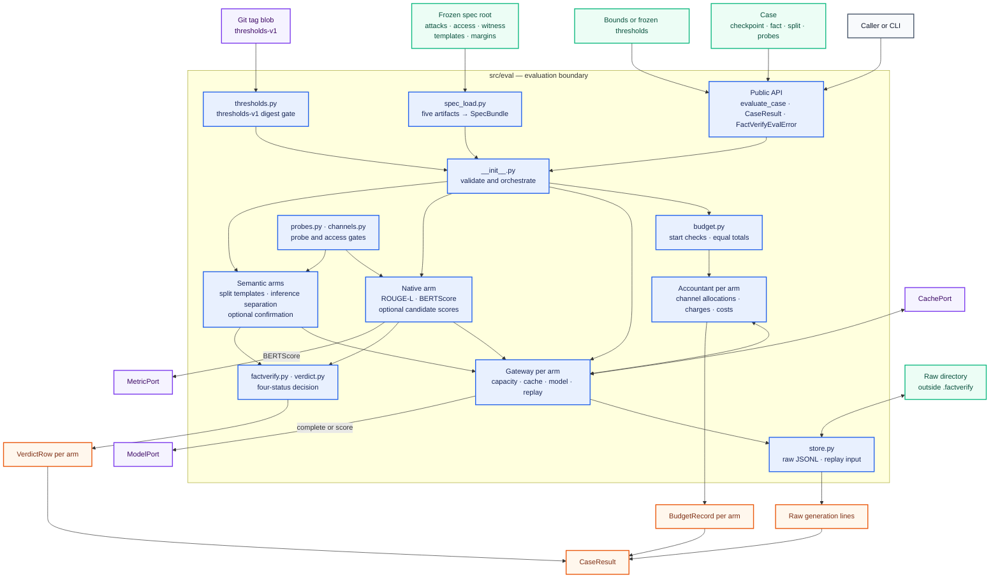
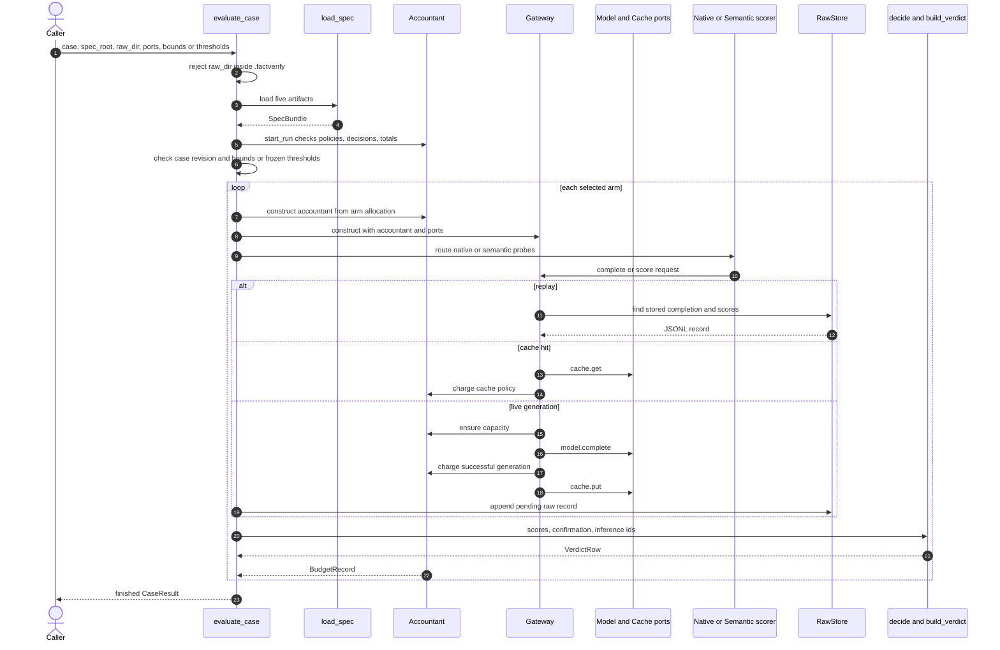
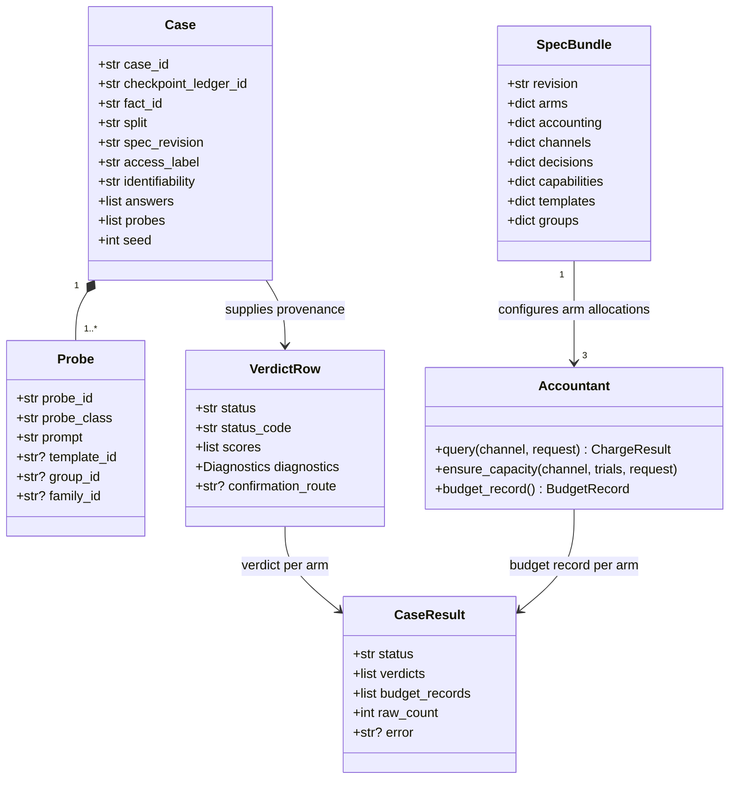

# Evaluator and query-budget architecture

**Reviewed implementation:** [`src/eval/`](../src/eval/)  
**Reviewed design:** [`specs/20260927-120701-evaluators-query-budget/`](../specs/20260927-120701-evaluators-query-budget/)  
**Feature:** FV-EVAL — P2-2 Evaluators and Query-Budget Accountant  
**Document date:** 2026-09-27

## Purpose

`src.eval` evaluates a case under three comparable arms: `native`, `semantic_only`, and `factverify`. It loads the evaluation policy from five spec artifacts, checks equal declared budgets, routes all live model access through a shared gateway, records per-channel charges, keeps raw completions for audit, and emits one verdict and one budget record per arm.

The intended public package contract is:

```python
from src.eval import CaseResult, FactVerifyEvalError, evaluate_case
```

`BudgetExhaustedError` is available from `src.eval.errors` for callers that need to distinguish an overspend refusal.

## Component relationship diagram



The raw Mermaid source is in [`diagrams/evaluator-query-budget-relationships.mmd`](diagrams/evaluator-query-budget-relationships.mmd). A rendered PNG is stored beside it.

## Module responsibilities

| Module | Responsibility | Main relationships |
|---|---|---|
| [`__init__.py`](../src/eval/__init__.py) | Public API and complete case orchestration | Composes every other runtime module |
| [`types.py`](../src/eval/types.py) | Case, probe, request, budget, score, threshold, verdict, and result records | Shared by the whole package |
| [`spec_load.py`](../src/eval/spec_load.py) | Reads five artifacts and builds `SpecBundle`; parses cases | Supplies policy to budgets, gates, routing, and decisions |
| [`budget.py`](../src/eval/budget.py) | Start checks, per-channel accounting, refusal records, cost record construction | Called by `Gateway`; uses `cost.py` |
| [`cost.py`](../src/eval/cost.py) | Initializes a complete zero-valued cost vector | Filled by `Accountant.budget_record()` |
| [`gateway.py`](../src/eval/gateway.py) | Sole live model/cache boundary, replay lookup, timing and hardware measurements | Mediates `ModelPort`, `CachePort`, and `Accountant` |
| [`channels.py`](../src/eval/channels.py) | Checks whether the spec and access capabilities permit a channel operation | Used directly by native candidate scoring |
| [`probes.py`](../src/eval/probes.py) | Resolves native, equivalence, locality, inference, and excluded probes | Uses closure templates and split groups |
| [`native.py`](../src/eval/native.py) | Computes text metrics and optional candidate-score metrics | Uses `Gateway`, `MetricPort`, access gate, probe resolver |
| [`semantic.py`](../src/eval/semantic.py) | Separates primary equivalence/locality probes from inference probes | Uses the probe resolver |
| [`factverify.py`](../src/eval/factverify.py) | Applies identifiability, crossing, confirmation, and conformance decisions | Builds rows through `verdict.py` |
| [`verdict.py`](../src/eval/verdict.py) | Enforces the four public statuses and creates `VerdictRow` | Holds status-to-code mapping from `types.py` |
| [`thresholds.py`](../src/eval/thresholds.py) | Verifies the final-test thresholds file against `thresholds-v1` | Default source reads Git; tests inject a protocol implementation |
| [`store.py`](../src/eval/store.py) | Appends and reads per-case/per-arm raw JSONL outside `.factverify` | Receives pending generation records from the orchestrator |
| [`errors.py`](../src/eval/errors.py) | Evaluation, transport, and budget-exhaustion error types | Common failure vocabulary |
| [`run.py`](../src/eval/run.py) | Command-line wrapper and fixture ports | Calls the public API |

## Runtime sequence



All three arm allocations are checked by `start_run` even when the caller requests only one arm. One `Accountant` and one `Gateway` are then created for each arm that actually runs.

## Core data relationships



The records are ordinary mutable dataclasses. Ports are structural protocols, so production or test adapters can be supplied without inheriting a project base class.

## Spec inputs and policy ownership

`load_spec` requires these five files:

| Artifact | Fields consumed by this package |
|---|---|
| `attacks.yaml` | Revision, common cap, arm/channel allocations, accounting policies, channel definitions, blocking decisions |
| `access_profile.md` | Profile label, candidate capabilities, blocking decisions |
| `witness_rule.md` | Confirmation route enablement, raw-maximum role, no-witness policy, blocking decisions |
| `closure_templates.yaml` | Template classes and group-to-split assignments |
| `margins.yaml` | Status only; it is not used as a thresholds source |

Markdown artifacts are parsed from YAML front matter. Decisions from attacks, access, and witness artifacts are merged into one map. `start_run` requires D-17, D-20, D-21, D-22, and D-26 to be closed and rejects unresolved cache, retry, failure, discard, or reallocation policies. Candidate scoring separately requires D-18; verdict construction requires D-14.

The checked-in study artifacts still mark the relevant decisions open. The real `.factverify/spec` therefore refuses before evaluation. Closed fixture copies under `tests/fixtures/eval` demonstrate the implemented behavior without silently adopting the demo values as study policy.

## Budget and gateway relationship

Each arm owns an independent channel map. A channel tracks:

```text
remaining = permitted - charged_observations
```

Generation charges `prompt_count × sample_count` observations and new-compute trials. Cache hits, retries, failures, and discards derive observation and compute effects from their corresponding frozen policy. Overspend appends the request to the refusal list and raises `BudgetExhaustedError` without a partial charge.

The live completion path is ordered as capacity check → model call → successful-generation charge → cache write → raw-record commit. A transport failure is charged through the failure policy and does not also become a successful generation. Replay reads stored completions and never calls the model.

The budget record contains each channel allocation and remainder plus generated trials, scored candidates, token fields, exports, training steps, wall-clock time, GPU-hours, peak memory, permitted-versus-actual values, and refused requests. Several counters are present but remain zero because this package has no update path for input tokens, output tokens, exports, or training steps.

## Arm routing and scoring

| Arm | Accepted probes | Scores produced by the current orchestrator | Confirmation behavior |
|---|---|---|---|
| `native` | Only probes not found in the closure file and labeled `native` | ROUGE-L and BERTScore; Truth Ratio, answer probability, and answer rank when raw scoring is permitted | No semantic family confirmation |
| `semantic_only` | Closure equivalence and locality groups assigned to the case split; inference separated | Maximum prompt-variation ROUGE-L across primary probes | Uses the same optional route-A confirmation logic as `factverify` |
| `factverify` | Same routing as `semantic_only` | Same prompt-variation score path | Optional route-A confirmation after a crossing across at least two families |

Inference probes are excluded from the primary score and their template IDs are copied to `VerdictRow.inference_output`. Class `X` templates are rejected. A closure template mislabeled as native is still treated according to the closure file.

In the reviewed implementation, `semantic_only` and `factverify` call the same `_score_semantic_arm` function and the same `decide` function. Their observable differences come from the arm ID and spec-defined allocations rather than distinct scoring algorithms.

## Verdict relationship

The package exposes exactly four status phrases:

| Status | Code |
|---|---|
| `confirmed recovery witness` | `confirmed_recovery` |
| `conformant under the declared test` | `conformance` |
| `non-identifiable under this profile` | `non_identifiable` |
| `insufficient evidence/incomplete` | `incomplete` |

A structurally indistinguishable case short-circuits to non-identifiable after the start gate. Otherwise, a score strictly above its bound is a crossing. Only a successful enabled confirmation route produces confirmed recovery. An unconfirmed crossing is stored as `diagnostics.raw_maximum` and produces incomplete. Scores retain separate `channel_id`, `score`, and `bound` fields.

Final-test bounds come from `results/thresholds.json` only after its bytes match the Git blob at `thresholds-v1:results/thresholds.json`. Construction and calibration receive an explicit `Bounds` object labeled for the same split.

## Raw storage and replay

`RawStore` writes one file per case and arm:

```text
<raw_dir>/<case_id>__<arm_id>.jsonl
```

Each successful live generation is held as `Gateway.pending`, enriched with metric scores, and committed after the probe is scored. The stored record includes case/checkpoint/fact provenance, split, arm, channel, probe, prompt, completion, decoding, seed, and metric scores. The raw directory is rejected if any resolved path component is `.factverify`.

On a normal identifiable arm, the orchestrator checks that the stored line count equals `BudgetRecord.generated_trials`. Replay locates matching stored probe/channel rows, reuses their completion and metric scores, and skips model access.

## Intended guarantees versus observed implementation

The feature specification is marked **Draft**. This table distinguishes implemented mechanics from the complete stated contract.

| Requirement | Status | Evidence and limitation |
|---|---|---|
| FR-001: charge every model call and detect bypasses | Partial | Completion calls flow through `Gateway` and generation multiplicity is supported by `Accountant`. Candidate scoring is charged before `model.score_candidate`, has no capacity check, ignores `sample_count`, and never consumes channel allocation. The bypass scanner is a text scan rather than the specified AST check and can miss calls such as `model.complete(...)` outside `gateway.py`. |
| FR-002: refuse overspend and record it | Implemented for observation-consuming accountant requests | `_consume` and `ensure_capacity` raise without partial charge and retain the refused request. Candidate scoring does not participate in this capacity rule. |
| FR-003: equal totals across all three arms | Implemented | Each channel sum, cross-arm equality, and optional `common_cap` equality are checked before arm selection. |
| FR-004: complete cost records | Partial | Every declared dataclass field exists; timing, GPU-hours, memory, generated trials, and scored candidates are populated. Token, export, and training-step fields have no measurement/update path and remain zero. Reference trials are counted internally but absent from the returned record. |
| FR-005: isolate confirmation reserve | Implemented in the accountant | Confirmation has its own channel, and cross-channel spending requires explicit reallocation. Reallocation refusal does not increment a channel's `refused` counter, though it is added to `refused_requests`. |
| FR-006: frozen cache/retry/failure policies | Partial | Policy interpretation and unresolved-field checks exist. The gateway implements cache hits and transport failures but has no retry or discard workflow; those paths are exercised directly through the accountant. |
| FR-007: access-profile channel enforcement | Partial | `permit` implements capability checks, but normal generation calls do not invoke it. Semantic generation bypasses it entirely. Native raw-score permission is checked on `raw_likelihood`, while the actual score request is charged under `prompt_variation`. |
| FR-008: five native metrics on native probes only | Implemented with an access-dependent subset | Native/closure separation works. Text metrics always run; the three score metrics are omitted when access is unavailable. `score_native` catches any `FactVerifyEvalError` from the access check and silently returns the text subset. |
| FR-009: split-isolated semantic probes and separate inference | Implemented | Template resolution overrides caller labels, group split mismatch raises, and inference IDs stay out of the primary score. Locality probes join the same primary prompt-variation path. |
| FR-010: one valid verdict per case/arm with provenance | Partial | Successful arms get one four-status row. `access_label` is copied from the caller's `Case`, not verified against or copied from the loaded access profile. `CaseResult.status="refused"` and `error` are never constructed; failures raise exceptions. |
| FR-011: confirmed witness only through frozen rule | Partial | D-14, route enablement, crossing, and route recording are checked. The implementation does not load or evaluate the full `acceptance_requires` rule. Its `no_witness_is_not_accept` branch returns conformance when the flag is true and there is no crossing, opposite the design note's stated meaning. |
| FR-012: frozen final-test thresholds | Partial | Path suffix, tag existence, byte digest, and bounds-argument exclusion are checked. The JSON schema and required channel coverage are not validated; an empty bounds map can pass and later fall back to `1.0`. JSON and numeric conversion errors are not wrapped in `FactVerifyEvalError`. |
| FR-013: separate channel scores and no combined average | Partial | Emitted scores are separate. Missing bounds silently default to `1.0`. The rejection helper checks top-level keys and a nested score dictionary, but not a list of score dictionaries as described by the contract. |
| FR-014: raw audit store and deterministic replay | Partial | Live successful generations are stored and ordinary arms compare raw lines with generated trials. Structurally indistinguishable arms return before this count check. Replay does not validate prompt, decoding, seed, or other stored provenance and does not reconstruct budget charges; its fallback may match a probe even when the channel differs. |
| FR-015: fail closed before the first model call | Partial | Required files, selected policies, named decisions, totals, revisions, paths, and bounds modes are checked early. `load_spec` does not comprehensively validate every normative field for null or `DECISION_REQUIRED`, and several malformed structures can raise generic Python exceptions. Missing per-channel bounds are accepted through defaults. |

## CLI limitations

[`run.py`](../src/eval/run.py) is currently a fixture runner rather than a complete study adapter:

- It supplies `_FixtureModel` only when the spec revision is `fixture-eval`; every other revision receives `_MissingModel`.
- It supplies bounds only for non-final fixture cases.
- It has no `--thresholds-path` or `--replay` option, so it cannot run the final-test or replay flows exposed by the library.
- It prints only the first verdict status and does not write the verdict/budget result JSON described by the contract.

Production integration therefore requires a real `ModelPort`, cache and metric adapters, calibrated bounds or frozen thresholds, and an output writer around the library API.

## Test coverage relationship

[`tests/test_eval.py`](../tests/test_eval.py) contains fourteen named hooks, FV-EVAL-001 through FV-EVAL-014. They cover accountant policies, overspend, equal totals, cost-field presence, confirmation isolation, cache/retry/failure arithmetic, access gating, probe routing, verdict vocabulary, confirmation decisions, threshold tag matching, separate scores, raw persistence, and model-free replay.

The tests use scripted ports and closed fixture specs. They establish the intended orchestration paths without exercising a real loaded model, metric model, persistent cache, study CLI, full thresholds schema, altered replay metadata, or the still-open production specification.

## Source index

- Requirements and acceptance scenarios: [`spec.md`](../specs/20260927-120701-evaluators-query-budget/spec.md)
- Entity definitions and states: [`data-model.md`](../specs/20260927-120701-evaluators-query-budget/data-model.md)
- Design decisions: [`research.md`](../specs/20260927-120701-evaluators-query-budget/research.md)
- Public API contract: [`contracts/evaluate_case.md`](../specs/20260927-120701-evaluators-query-budget/contracts/evaluate_case.md)
- Accountant and gateway order: [`contracts/accountant.md`](../specs/20260927-120701-evaluators-query-budget/contracts/accountant.md)
- Threshold gate: [`contracts/thresholds.md`](../specs/20260927-120701-evaluators-query-budget/contracts/thresholds.md)
- Verdict and raw-record contract: [`contracts/verdict_row.md`](../specs/20260927-120701-evaluators-query-budget/contracts/verdict_row.md)
- Plan, implementation state, and usage: [`plan.md`](../specs/20260927-120701-evaluators-query-budget/plan.md), [`tasks.md`](../specs/20260927-120701-evaluators-query-budget/tasks.md), [`quickstart.md`](../specs/20260927-120701-evaluators-query-budget/quickstart.md)
