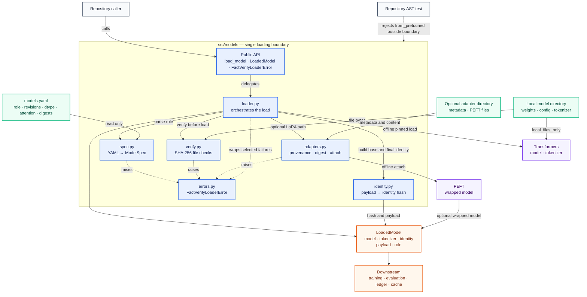
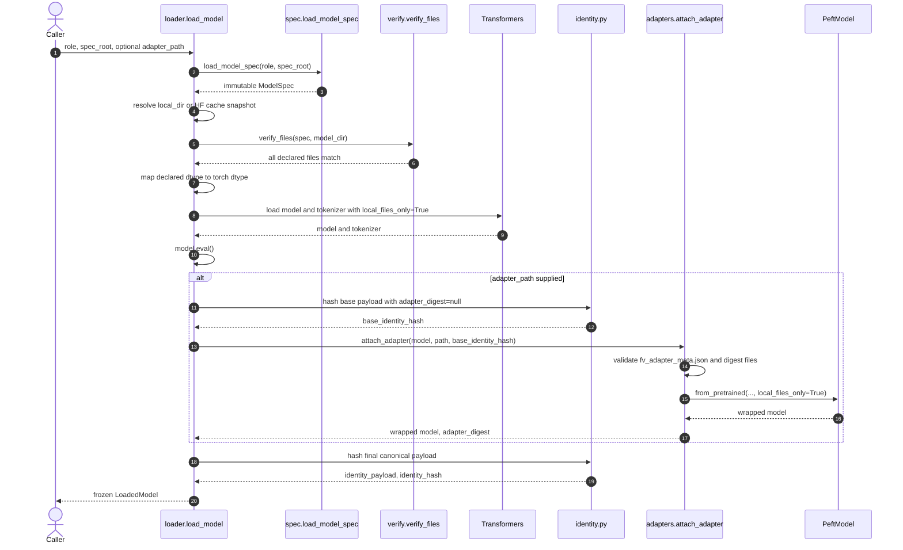
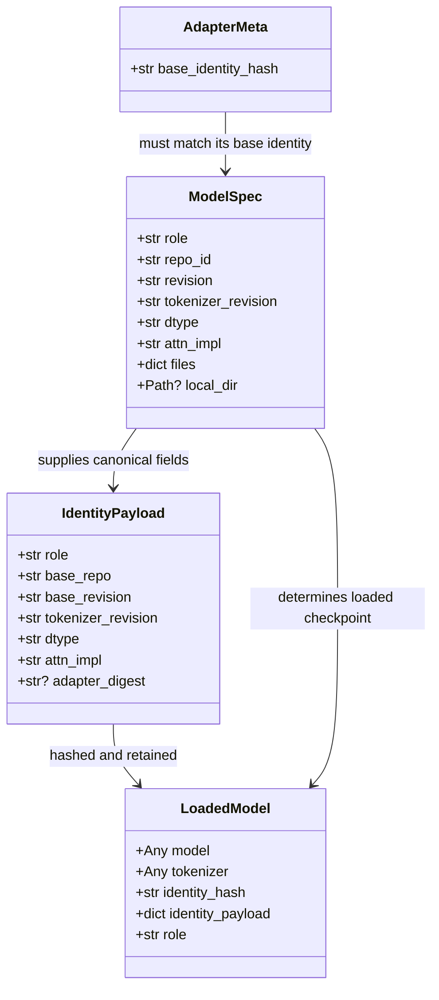

# Model loader architecture and code relationships

**Reviewed implementation:** [`src/models/`](../src/models/)  
**Reviewed design:** [`specs/20260926-105952-model-loader/`](../specs/20260926-105952-model-loader/)  
**Feature:** FV-MODEL — P2-0 Model Loader  
**Document date:** 2026-09-27

## Purpose

`src.models` is the repository's provenance boundary for loading study checkpoints. A caller supplies a role, a versioned file under `config/models/`, and the spec directory that holds `model_policy.yaml`. The package resolves that role, verifies local files, loads the model and tokenizer without downloads, optionally validates and attaches a LoRA adapter, and returns the checkpoint together with a stable identity record.

```python
load_model(role, model_config=path, spec_root=spec_root)
```

`model_policy.yaml` names the jobs (`controlled_fact_base`, `pretrained_fact_confirmation`) and does not pin a repository. Each configuration uses `model_revision` for the weight commit. New identity hashes are schema version 2 and do not include the role name.

The public contract contains only three names:

```python
from src.models import FactVerifyLoaderError, LoadedModel, load_model
```

Callers should treat every other symbol in the package as internal.

## Component relationship diagram



The raw Mermaid source is in [`diagrams/model-loader-relationships.mmd`](diagrams/model-loader-relationships.mmd). A rendered PNG is stored beside it.

## Module responsibilities

| Module | Owns | Depends on | Main output |
|---|---|---|---|
| [`__init__.py`](../src/models/__init__.py) | The public package surface | `loader.py`, `errors.py` | Three exported names |
| [`loader.py`](../src/models/loader.py) | End-to-end orchestration, local directory resolution, dtype mapping, Transformers calls, eval mode, result construction | All internal modules; Transformers, PyTorch, Hugging Face Hub constants | `LoadedModel` |
| [`spec.py`](../src/models/spec.py) | YAML parsing and required-field validation | PyYAML, `errors.py` | Immutable `ModelSpec` |
| [`verify.py`](../src/models/verify.py) | Streaming SHA-256 verification of declared local files | `ModelSpec`, `errors.py` | Successful validation or error |
| [`identity.py`](../src/models/identity.py) | Canonical identity payload and deterministic SHA-256 | `ModelSpec` | Payload dictionary and 64-character hash |
| [`adapters.py`](../src/models/adapters.py) | Adapter metadata validation, deterministic content digest, local PEFT attachment | PEFT, `errors.py` | Wrapped model and adapter digest |
| [`errors.py`](../src/models/errors.py) | Package-specific failure type | `ValueError` | `FactVerifyLoaderError` |

`loader.py` is the coordinator. The helper modules do not call one another except that `identity.py` and `verify.py` consume `ModelSpec`; all paths converge in `load_model`.

## Runtime flow



The ordering establishes the main safety property: declared base files are checked before either Transformers loading call. Adapter compatibility is checked before the PEFT attachment call, although the base model and tokenizer have already been constructed by then.

## Core data relationships



Both Python dataclasses are frozen, so their attributes cannot be reassigned. The objects held inside `LoadedModel` remain mutable: callers can still call `result.model.train()`, mutate `identity_payload`, or change the underlying model. “Immutable” therefore describes the dataclass fields, not deep immutability.

## Identity construction

The identity payload is assembled only from the role specification and the computed adapter digest:

```json
{
  "adapter_digest": null,
  "attn_impl": "eager",
  "base_repo": "factverify-test/tiny-base",
  "base_revision": "aaaaaaaaaaaaaaaaaaaaaaaaaaaaaaaaaaaaaaaa",
  "dtype": "float32",
  "role": "tiny_base",
  "tokenizer_revision": "aaaaaaaaaaaaaaaaaaaaaaaaaaaaaaaaaaaaaaaa"
}
```

`compute_identity_hash` serializes this mapping with sorted keys and compact JSON separators, then hashes the UTF-8 bytes with SHA-256. For an adapter-backed checkpoint, the loader first computes the base identity with `adapter_digest = null`; `fv_adapter_meta.json` must name that base hash. It then computes the adapter digest and replaces `null` with that digest for the final checkpoint identity.

The adapter digest includes each immediate regular file in the adapter directory except `fv_adapter_meta.json`. It hashes the filename, a newline, the file bytes, and another newline in filename-sorted order. Renaming or changing an included file changes the digest. Nested files are currently ignored.

The identity does not directly contain base-file digests or the local path. Reproducibility depends on `verify_files` establishing that the local bytes match `models.yaml` before the spec-derived identity is accepted.

## Model directory resolution

`ModelSpec.local_dir` is an implementation extension useful for tests and explicit local layouts. A relative value is resolved against `spec_root`; an absolute value is resolved directly. Without `local_dir`, the loader derives the normal Hugging Face cache snapshot path:

```text
HF_HUB_CACHE/models--<repo_id with / replaced by -->/snapshots/<revision>
```

Loading remains local because the model, tokenizer, and adapter calls all use `local_files_only=True`. Network retrieval belongs to [`scripts/prefetch_models.py`](../scripts/prefetch_models.py), outside the runtime loader.

## Failure relationships

| Stage | Detected conditions | Result |
|---|---|---|
| Spec parsing | Missing `models.yaml`, unknown role, malformed YAML, non-mapping role, missing/null required field, empty `files` mapping | `FactVerifyLoaderError` before model loading |
| Base verification | Missing local directory, missing declared file, SHA-256 mismatch | `FactVerifyLoaderError` before model loading |
| Dtype parsing | Value outside `float32`, `float16`, `bfloat16`, `auto` | `FactVerifyLoaderError` before model loading |
| Transformers load | `OSError` | Wrapped as a role/path-specific `FactVerifyLoaderError` |
| Hardware/settings load | `ValueError` or `RuntimeError` | Wrapped as a dtype/attention-specific `FactVerifyLoaderError` |
| Adapter provenance | Missing/unreadable metadata, missing base hash, base mismatch | `FactVerifyLoaderError` before PEFT attachment |
| PEFT attachment | Errors raised by `PeftModel.from_pretrained` | Currently propagate without loader wrapping |

There is no mutable module-level state or cache. Each call repeats parsing, file hashing, object loading, and identity construction.

## Intended guarantees versus observed implementation

This table records the relationship between the feature specification and the code as reviewed. “Partial” means the main mechanism exists but one or more stated checks are absent or weaker than the specification.

| Requirement | Status in reviewed code | Evidence and limitation |
|---|---|---|
| FR-001: accept role/spec root and use pinned revisions | Implemented for the loader's expected YAML shape | The API exposes no repository or revision override. Model and tokenizer revisions are passed from `ModelSpec`. |
| FR-002: verify every declared file and reject missing, changed, or extra files | Partial | Declared files are checked before loading. `verify_files` does not scan for undeclared extra files, although the spec, contract, and data-model V4 require rejection. |
| FR-003: load only from local storage | Implemented at library-call level | All three `from_pretrained` calls set `local_files_only=True`. The test asserts those arguments; it does not open a socket guard. |
| FR-004: return canonical stable identity | Implemented | Compact sorted-key JSON and SHA-256 are deterministic for the same `ModelSpec` and adapter digest. |
| FR-005: reject adapter trained on another base | Implemented | Metadata comparison occurs before `PeftModel.from_pretrained`. |
| FR-006: digest adapter weights/config | Partial | All immediate regular files except the metadata sidecar are hashed. This is broader than named weight/config files but excludes nested files. |
| FR-007: apply exact dtype and attention implementation, reject fallback | Partial | Declared arguments are passed and selected load exceptions are wrapped. Code does not inspect every loaded parameter or the effective attention implementation after construction. |
| FR-008: return eval-mode model | Partial for adapter path | `eval()` is called on the base before adapter wrapping. The returned `PeftModel` is not explicitly put into eval mode after attachment, and the adapter test does not assert its mode. |
| FR-009: prohibit loading calls outside `src/models` | Implemented by test policy | An AST test scans repository Python files for any `.from_pretrained` attribute outside `src/models`, with explicit exclusions. |
| FR-010: one descriptive loader error on every invalid input | Partial | Spec, verification, dtype, base-load, and provenance failures use `FactVerifyLoaderError`; PEFT attachment errors and some filesystem/type failures can escape as other exceptions. |

## Integration mismatches to resolve

The checked-in production artifact [`.factverify/spec/models.yaml`](../.factverify/spec/models.yaml) does not currently match the schema consumed by `src.models.spec`:

| Production artifact | Loader expects | Consequence |
|---|---|---|
| Roles nested under top-level `roles:` | Role keys at the YAML root | A request such as `blocks_0_2` is reported as unknown |
| `model_revision` | `revision` | The required field is unresolved |
| No `attn_impl` field | Required `attn_impl` | The required field is unresolved |
| File hashes use `sha256:<hex>` in the documented production convention | Raw hexadecimal digest comparison | A prefixed digest will never equal `_sha256()` output |
| Pending decision placeholders and empty file maps | Fully resolved non-null fields and non-empty `files` | Loading correctly fails closed until decisions and digests are finalized |

The test fixture uses the loader's expected shape, so the model-loader tests do not expose this production integration mismatch. The feature specification also remains marked **Draft**, with D-46, D-48, and D-50 described as open decisions.

Two adjacent inconsistencies also matter:

- `prefetch_models.py` reads the same flat role schema as the loader and therefore has the same incompatibility with the current production artifact.
- It reads `tokenizer_revision` but downloads every declared file using the model `revision`; a distinct tokenizer revision is not used for retrieval.

## Test coverage relationship

[`tests/test_models_loader.py`](../tests/test_models_loader.py) maps nine named hooks to FV-MODEL-001 through FV-MODEL-009. It covers revision arguments, declared-file corruption, offline flags, repeatable identities, adapter base matching, adapter digest changes, dtype argument/error wrapping, base-model eval mode, and the repository entry-point rule.

The tests use mocked Transformers and PEFT constructors. This keeps the suite fast but differs from the research note's stated choice of loading a real tiny committed model. The task list also leaves the end-to-end quickstart smoke test T023 unchecked. As a result, the tests establish orchestration behavior but do not exercise real deserialization, logits determinism, effective dtype/attention, or returned adapter eval mode.

## Safe extension points

- Add a new model role by updating the frozen `models.yaml` shape that the parser actually supports and providing all required digests. No loader code should need to change.
- Change the canonical identity only in `identity.py`, then update adapter metadata producers and cache/ledger consumers together.
- Extend supported dtype strings in `_parse_dtype`; keep failure closed for unknown values.
- Add adapter metadata fields in `fv_adapter_meta.json` without affecting digest stability because that sidecar is intentionally excluded from the adapter content digest.
- Keep all future model, tokenizer, and adapter `from_pretrained` calls inside `src/models`; the repository AST test treats any other placement as a provenance gap.

## Source index

- Public contract: [`contracts/load_model.md`](../specs/20260926-105952-model-loader/contracts/load_model.md)
- Requirements and success criteria: [`spec.md`](../specs/20260926-105952-model-loader/spec.md)
- Intended entities and validation rules: [`data-model.md`](../specs/20260926-105952-model-loader/data-model.md)
- Design decisions: [`research.md`](../specs/20260926-105952-model-loader/research.md)
- Implementation plan and task state: [`plan.md`](../specs/20260926-105952-model-loader/plan.md), [`tasks.md`](../specs/20260926-105952-model-loader/tasks.md)
- Usage example: [`quickstart.md`](../specs/20260926-105952-model-loader/quickstart.md)
